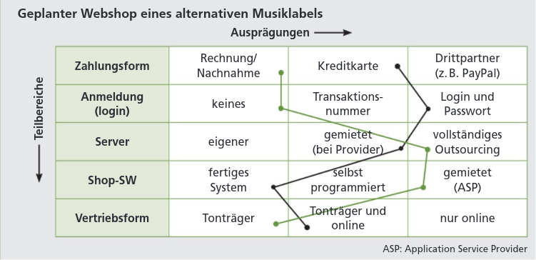

= ITP Mitschrift
Raphael Scharrer

:sourcedir: ../src/main/java
:icons: font
:sectnums:    // Nummerierung der Überschriften / section numbering
:toc: left

== Git

== Repo + Github Pages
. Order erstellen und in IntelliJ öffnen.
. VCS in IntelliJ aktivieren => Git|Github|Share Project => Inhalt des Doc-as-code Ordner in Projekt Ordner ziehen.
. .env -Datei erstellen mit folgendem Inhalt:

 GIT_GLOBAL_MAIL=<mail>
 GIT_GLOBAL_USER_NAME=<name>

. Docker starten:

 service docker start

. Page erstellen:

 sudo ./run-docker-inside-docker.sh

Die Page wurde nun erstellt und nimmt den Inhalt aus dem index.adoc File.
Aktualisiert wird die Page bei erneutem Ausführen vom letzten oben angeführten Befehl.

== Branches

== Asciidocs
- PlantUML in Adoc File verlinken:

 [plantuml, <umlName>]
 ----
 include::<relativerPfad>[]
 ----

- PlantUML in Adoc File erstellen:

 [plantuml, <umlName>]
 ----
 @startuml
 class Test1
 class Test2
 class Test3
 Test1 <|-- Test2
 Test1 <|-- Test3
 @enduml
 ----

Beides erzielt das selbe Ergebnis:

[plantuml, UMLdefinition1]
----
include::./plantuml/UmlAsciiDefinition.puml[]
----

== UML

== ITP Theorie

== Projekt G

Phasen:

- Projektinitialisierung

Proje

- Projektplanung
- Projektdurchführung
- Projektevaluierung

== Kreativitätstechniken

=== Brainstorming

5-7 Teilnehmer | 10-20min

Ideen/Lösungen zu einem Ziel/Problem werden mündlich geäußert. Protokollierung und Überwachung erfolgen durch einen Moderator. Bewerten/Kritisieren der Ideen erfolgt erst in einer zweiten Phase.

=== Methode 6-3-5 / Brainwriting

6 Teilnehmer entwickeln schriftlich 3 Ideen in 5min, danach Ideen Austausch. Die beiden Phasen wiederholen sich. In 30min entstehen hiermit um die 108 Ideen.

=== Mindmapping

Hauptthema und Hauptäste in Blockbuchstaben | Pro Linie/Ast nur ein Wort

*Anwendung:* Wird genutzt um ein Themengebiet in möglichst kleine Teile zu spalten. Die beiden Seiten können auch in Pro und Kontra geteilt werden, um für Übersicht in dieser Hinsicht zu sorgen.

[plantuml, MindMapDefinition]
----
include::./plantuml/MindMapDefinition.puml[]
----

=== Morphologischer Kasten / Zwicky-Box

Im Morphologischen Kasten breitet sich in mindestens 2 Dimensionen - *Teilbereiche* und *Ausprägung* - aus.

Die *Teilbereiche* geben die namensgebenden Teilbereiche an in welche eine Möglichkeit/Variante zu ermitteln ist. Sie sind voneinander unabhängig und maximal 7.

Die *Ausprägung* gibt nun die Möglichkeiten der jeweiligen Bereiche an. Sie sind voneinander unabhängig und möglichst genau.

*Anwendung:* Der Kasten dient zur Analyse/Auswahl einer passenden Kombination der Lösungen.

- Synektik
- Delphi-Methode

== V-Modell

*Anwendung:* Es beschreibt die praktischen Schritte vom Beginn eines Programms bis zum Ende von Diesem.

TIP: Das V-Modell ist die Erweiterung des Wasserfall Modells

V-Modell IMG einfügen

== Usecase Diagramm